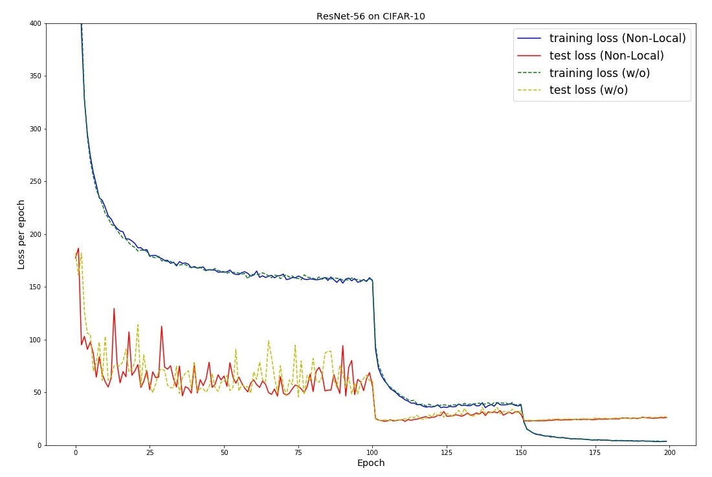

# PyTorch Implementation of Non-Local Neural Network

This repository contains my implementation of [Non-Local Neural Netowrks (CVPR 2018)](https://arxiv.org/pdf/1711.07971.pdf).

To understand more about the structure of this paper, you may refer to this [slide](https://www.youtube.com/redirect?redir_token=4Bf1C-e-Vz_0r5HbPD9meYLcyL58MTU1MTc5MjE0NEAxNTUxNzA1NzQ0&q=https%3A%2F%2Fwww.slideshare.net%2FTaeohKim4%2Fpr083-nonlocal-neural-networks&v=ZM153wo3baA&event=video_description) and [video](https://www.youtube.com/watch?v=ZM153wo3baA) which is in Korean.

The experiment was run on CIFAR-10 dataset for the sake of ensuring that the code runs without error.

## Implementation Details
The original paper used ResNet-50 as its backbone structure for conducting experiment on video datasets such as Kinetics, Charades.

As an inital study, I adopted ResNet-56 strucutre for CIFAR-10 dataset which is a 2D classification. The architecture is implemented in `models/resnet2D.py`.

Original baseline model from the paper called C2D uses ResNet-50 as its backbone and 1 non-local block after the 4th residual block. This structure is implemented in `models/resnet3D.py`. The detail of the architecture is shown in the below figure:

</img>

The four different pairwise functions discussed in the paper are implemented accordingly in `models/non_local.py`. You can simply pass one of the operation as an argument. The details of the non-local block is shown in the below figure:

</img>

Finally, the original experiment of activity recognition was similarly replicated in `3D_experiment` folder. The necessary data preprocessing code was borrowed from https://github.com/kenshohara/3D-ResNets-PyTorch. The training is run without error but I didn't have enough time to compare the performance boost from the addition of non-local block.

## Training
1) To start training for CIFAR-10 with ResNet-56, you can simply execute `run.sh`. 

2) To start training for HMDB51 dataset with C2D, you first need to prepare the HMDB51 dataset as instructed in the `3D_experiment` folder. Then, execute `run.sh`. It seems like use of multiple GPU(s) may be need due to memory issues.

## Results
Trained on CIFAR-10 for 200 epochs using the command shown in `run.sh`. The training was conducted using single 1080ti GPU.
The result showed that there wasn't a huge performance boost for image classification task on CIFAR-10. The below graph illustrates the loss curves for two different networks.

</img>

The Top-1 validation accuracy for ResNet-56 without non-local block was *93.97%* while the one with non-local block had *93.98%* validation accuracy.

This could be due to two reasons: 1) the proposed task was mainly for video classification 2) the input size of CIFAR-10 is too small so may not maintain spatial information after the second resnet block.

## TO DO
- [x] Compare the result of baseline model and that of non-local model for CIFAR-10
- [x] Prepare video dataset (e.g. UCF-101, HMDB-51)
- [x] Modify the model code to adapt to spatiotemporal settings
- [x] Run test on some video datasets
- [ ] Run test on image segmentation dataset (e.g. COCO)

## Reference
This repo is an adaptation from several other exisitng works.
- https://github.com/akamaster/pytorch_resnet_cifar10
- https://github.com/kuangliu/pytorch-cifar
- https://github.com/facebookresearch/video-nonlocal-net
- https://github.com/AlexHex7/Non-local_pytorch
- https://github.com/kenshohara/3D-ResNets-PyTorch

